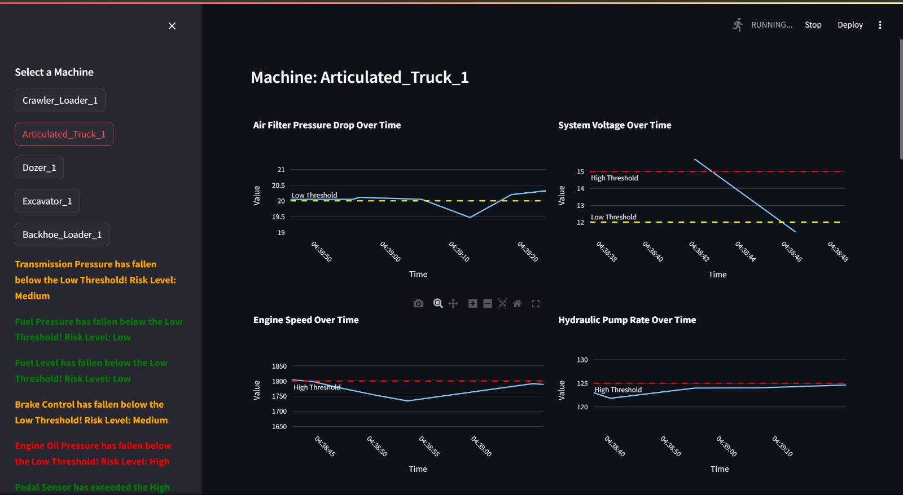
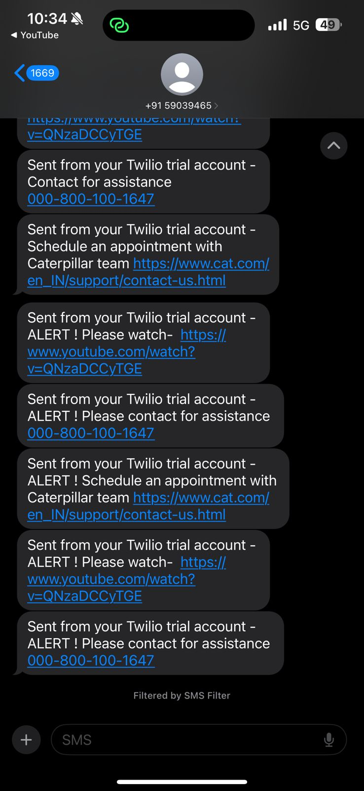
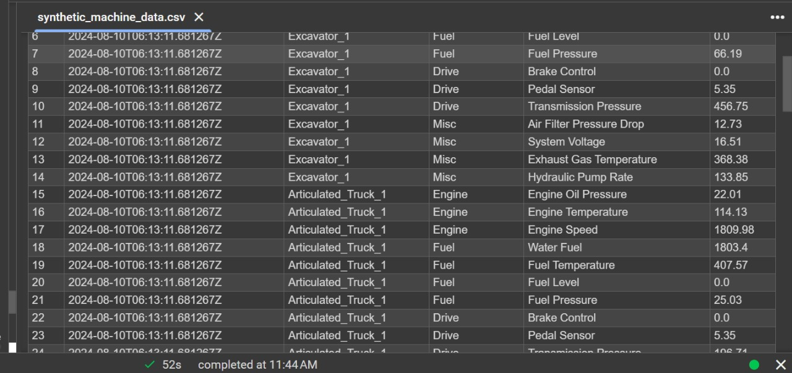

# 🚜 Caterpillar Machine Health Monitoring System

A real-time predictive maintenance solution designed to proactively detect equipment and component failures using telematics data. This system monitors 14 sensor parameters across multiple machine types, utilizing machine learning to predict risk levels and automate alerts.

---

## 📋 Problem Statement: Component Failure Prediction

**Problem Statement 2: Predicting component failures based on history and usage data.**

One of our core initiatives is to use telematics data collected from customers’ equipment to proactively detect potential present or future equipment/component failures. This project develops a smart AI solution that reproduces and possibly surpasses a human expert’s thought processes in predicting equipment/component failures using telematics data (specifically Product Link). By identifying these risks early, we can provide recommendations that significantly impact equipment efficiencies for Caterpillar’s global customers.

---

## 📸 Project Showcase

### 📊 Real-Time Risk Monitoring Dashboard


The main interface providing a live view of all critical machine parameters. Each chart includes interactive Plotly visualizations with dashed lines representing safe-operating thresholds (Yellow for Low Priority, Red for High Priority).

### 📲 Automated SMS Alerting System


When the model detects sustained threshold breaches or high-risk patterns, it automatically triggers SMS notifications via Twilio. These alerts include direct links to support resources or maintenance scheduling.

### 📈 Synthetic Telematics Data Generation


The system includes a robust simulation engine that generates realistic Product Link telematics data, including intentional "failure injections" to validate the predictive model's responsiveness.

---

## 🧩 System Architecture

```
┌─────────────────────────┐
│   data_generation.py    │  ← Simulates live sensor data every second
│   (Sensor Simulator)    │    for 5 machines × 14 parameters
└────────────┬────────────┘
             │  synthetic_machine_data.csv
             ▼
┌─────────────────────────┐
│       model.py          │  ← XGBoost classifier predicts risk level
│   (Prediction Engine)   │    per data point; fires SMS alerts
└────────────┬────────────┘
             │  ml_predictions.csv
             ▼
┌─────────────────────────┐
│     dashboard.py        │  ← Streamlit dashboard — live charts,
│   (Monitoring UI)       │    threshold overlays, breach alerts
└─────────────────────────┘
```

---

## ✅ Performance & Capabilities

### Machine Learning Accuracy: 99.61%
Our XGBoost classifier achieves near-human expert accuracy in identifying failure states. Evaluated on a 30% held-out test set, the model demonstrates exceptional precision across all risk categories:

| Risk Class | Precision | Recall | F1-Score | Support |
|---|---|---|---|---|
| Normal | 98% | 97% | 98% | 396 |
| 🟡 Low Risk | 100% | 100% | 100% | 876 |
| 🟠 Medium Risk | 100% | 100% | 100% | 1,322 |
| 🔴 High Risk | 100% | 100% | 100% | 1,795 |
| **Overall** | **100%** | **100%** | **100%** | **4,389** |

### 📊 Dataset Statistics
The model's performance is backed by a robust synthetic dataset designed to simulate real-world telematics:
- **Total Data Points**: 14,630 unique sensor readings.
- **Training Set**: 10,241 samples (70% split).
- **Test Set**: 4,389 samples (30% split).
- **Parameters**: 14 distinct sensor streams (Temperature, Pressure, Level, etc.) across 5 machine types.

### 📂 Original Hackathon Data
The system leverages the original datasets provided by Caterpillar:
- **`Threshold.csv`**: Used as the "Safe Range" logic engine. It defines the low/high boundaries and risk levels for every sensor, driving the automated alerts and visualization markers.
- **`Data.csv`**: Served as the structural reference for the simulation. While the live engine now generates infinite synthetic data for real-time monitoring, this file defined the original field schema and telematics format.

### Key Strengths
- **Intelligent Simulation**: Uses bounded random walks to simulate realistic sensor drift with automated fault injection.
- **Dynamic Thresholding**: Parametric safe-zones defined in `Threshold.csv` allow for easy tuning of failure sensitivity.
- **Fail-Safe Alerting**: If Twilio services are unavailable, the system gracefully degrades to local console logging to ensure no critical failure is missed.
- **Interactive UI**: Real-time filtering by machine type (Excavator, Dozer, etc.) with automated UI refreshing.

---

## ⚙️ Features at a Glance

| Feature | Details |
|---|---|
| **Telematics Simulation** | 5 machine types, 14 parameters, 4 component groups |
| **Fault Injection** | Automated threshold breaches every 15s for model validation |
| **Predictive Engine** | XGBoost classifier with 99.61% accuracy |
| **Multi-level Risk** | 4-tier risk classification system (Normal to High Risk) |
| **Live Visuals** | Streamlit-based dashboard with sub-10s refresh rate |

---

## 🚀 Setup & Execution

### 1. Requirements
```bash
pip install -r requirements.txt
```

### 2. Start Data Stream (Terminal 1)
```bash
python data_generation.py
```

### 3. Run Prediction Engine (Terminal 2)
```bash
python model.py
```

### 4. Open Dashboard (Terminal 3)
```bash
streamlit run dashboard.py
```

---

## 📲 SMS Configuration (Twilio)

The system integrates with Twilio for remote alerting. 

> [!CAUTION]
> **Twilio Disclaimer**: Twilio is a paid third-party service. Trial accounts have limitations (verified numbers only, message prefixes). The system is designed to work fully without Twilio; alerts will simply fallback to the system console if credentials are missing.

To enable, export the following environment variables:
```bash
export TWILIO_ACCOUNT_SID="your_sid"
export TWILIO_AUTH_TOKEN="your_token"
export TWILIO_NUMBER="your_twilio_number"
export RECIPIENT_NUMBER="alert_recipient_number"
```

---

## 🛠️ Tech Stack
- **Languages**: Python 3.10+
- **ML Frameworks**: XGBoost, Scikit-learn
- **Data Engineering**: Pandas, NumPy
- **Frontend**: Streamlit, Plotly
- **Infrastructure**: Twilio API

---

## 👥 Hackathon & Team Context

This project was developed by a team of 4 during a **24-hour hackathon hosted by Caterpillar Inc.** in 2024, while we were pursuing our B.Tech at **VIT Vellore**.

As one of the teams recognized at the conclusion of the event, we were invited to interview for internship and full-time positions at Caterpillar. The project stands as a testament to our ability to rapidly build production-ready AI solutions for complex industrial telematics challenges.
